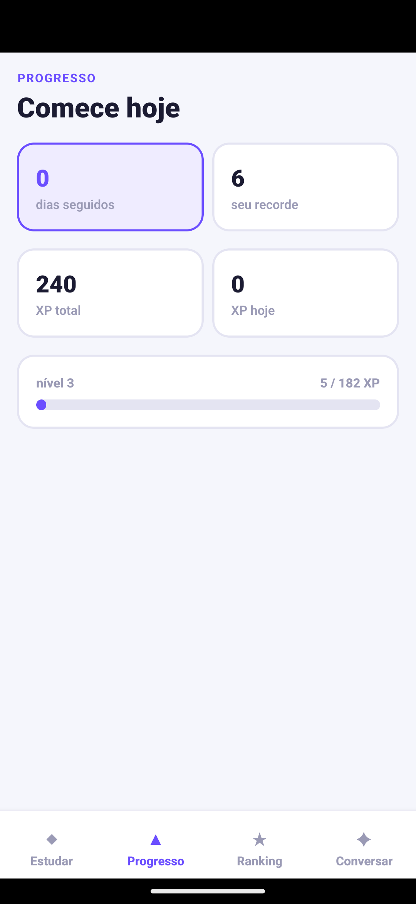

# Cadência · app

**A área do aluno no celular.** Sessão de flashcards com repetição espaçada, que
responde no toque e sobe em lote.

React Native com Expo. Consome a API do
[Cadência](https://github.com/KarolNutty/cadencia).


> A carta, o verso revelado e os quatro botões de avaliação. O intervalo até a
> próxima revisão é calculado no aparelho, pelo mesmo módulo que o servidor usa.

```bash
npm install
npm run android  # com um emulador já aberto
npm test         # 71 testes
```

O `package-lock.json` está versionado, e é isso que torna a instalação
reproduzível: sem ele, o npm resolve versões diferentes a cada máquina, e um
pacote interno do Metro pode vir incompleto. Se `npm install` falhar com módulo
não encontrado, `npm ci` instala exatamente o que está no lockfile.

As versões estão **fixadas**, e não com `^`. O Expo espera um conjunto que
funciona junto: `react-native-reanimated` aceita `react-native` de 0.83 a 0.86,
e `^` puxaria a 0.87, quebrando a instalação com conflito de dependência entre
pares.

`npx expo install --check` confere se o conjunto continua coerente.

A API precisa estar rodando. O app descobre o IP da máquina pelo Expo, então
funciona no aparelho de verdade e não só no emulador.

---

## A decisão que organiza o projeto

> **O agendamento é calculado no aparelho, pelo mesmo módulo que o servidor
> usa.**

Quem avalia trinta cartas em três minutos não pode esperar a rede a cada uma. A
tela responde no toque, e o envio acontece em lote no fim da sessão.

O servidor recalcula ao receber, e a resposta dele é a autoridade. O cálculo
local existe para a tela responder, não para substituir o servidor: mandar o
agendamento pronto deixaria o aluno decidir o próprio intervalo.

### O domínio é uma cópia, com trava

A fonte única seria melhor, e não funciona bem aqui: o Metro não lida bem com
pacote entregue como fonte TypeScript sem compilação, e resolver isso exigiria
um passo de build e versionamento no outro repositório. Foi o que travou uma
tentativa anterior de manter tudo num monorepo.

A escolha foi copiar. O risco é conhecido: alguém muda a regra de um lado e não
do outro, e a partir daí o app calcula um intervalo e o servidor grava outro.

`testes/dominio-identico.test.ts` transforma esse risco em falha visível. Ele
compara constantes e sequências inteiras com valores **escritos à mão**,
extraídos da execução no servidor. Se fossem calculados pelo próprio código, o
teste passaria mesmo depois de a regra mudar, que é exatamente o que ele existe
para impedir.

```
quem sempre acerta:  1, 3, 8, 20, 50, 120
quem acha difícil:   1, 3, 6, 11, 19, 30, 48
```

**Quando esse teste falhar, a pergunta não é como fazer passar.** É se a mudança
foi feita nos dois lados.

---

## Decisões

### Abas embaixo, e quatro delas




O polegar alcança o rodapé sem trocar a mão de posição, e o topo de um celular
grande não. Numa gaveta lateral, cada troca de seção custa dois toques em vez de
um.

Quatro é o limite prático: com cinco ou mais, os rótulos truncam e viram ícones
sem palavra, que ninguém decifra de primeira.

**Redação e nivelamento ficam só no portal web.** Escrever 150 palavras no
celular é castigo, e um teste de nivelamento respondido no ônibus mede
distração, não nível.

> Vai para o app o que se faz com o polegar, em pé, em cinco minutos.

### A barra de status some quando ninguém pinta atrás dela

O sintoma: relógio, bateria e sinal desaparecem quando o app abre, e voltam ao
sair. Parece que a barra ficou preta.

Ela não ficou. Com `edgeToEdgeEnabled`, o app desenha por baixo da barra e ela
fica **transparente**. Sem nada pintando essa área, aparece o fundo padrão da
janela, que é preto, e os ícones escuros do sistema somem sobre ele.

A correção tem duas partes, e a primeira não basta sozinha:

**Pintar a janela inteira**, com um `View` de fundo na raiz. É o que faltava.

**Escolher a cor certa dos ícones.** `StatusBar style` define a cor dos ícones,
não do fundo, e o nome engana: `dark` significa ícones escuros, para usar sobre
fundo claro.

### Conversação com correção


A correção fica presa à fala que a gerou, e fora do fio da conversa: um parceiro
que corrige dentro da resposta quebra o assunto e para de conversar.

### O estudo não se perde quando a rede cai

O aluno estuda vinte cartas no ônibus e o envio falha. Guardado só no estado da
tela, esse trabalho morre quando o app é fechado, e ninguém liga o sumiço à
causa.

O lote vai para o disco **antes** da tentativa de envio, e só sai de lá depois
da confirmação do servidor. Guardado como arquivo com `expo-file-system`, e não
com `AsyncStorage`: essa biblioteca precisa de código nativo que o Expo Go não
traz, e o app quebra com "Native module is null" na primeira gravação. O `loteId` nasce junto com o lote e é reusado em
toda tentativa: o servidor reconhece o mesmo lote e ignora o reenvio, em vez de
gravar tudo duas vezes.

Ao abrir o app, o que ficou de sessões anteriores sobe sozinho. E a tela mostra
quantas revisões estão esperando: **uma fila silenciosa é pior que nenhuma**,
porque a pessoa refaz tudo achando que perdeu.

### Toda tela de erro tem saída

Sem botão para tentar de novo, quem cai numa falha fica preso: recarregar não
ajuda, porque a busca falha de novo e o estado volta para lá. A única saída
seria fechar e reabrir, e ninguém liga isso à causa.

### A carta errada volta para a fila

Sair da tela ao errar faria o aluno ver a palavra difícil uma vez só, e é
justamente a que ele precisa ver de novo.

Mas volta **uma vez só**: repetir sem limite transformaria uma carta travada num
laço que não termina, e a sessão nunca acabaria.

### O progresso conta cartas, não avaliações

Com a repetição da carta errada, contar avaliações faria a barra andar para trás
quando alguém erra, o que parece defeito.

### Renovação de token em fila única

Uma tela que dispara três pedidos ao mesmo tempo tomaria três respostas 401, e
os três pediriam renovação com o mesmo token. Como a renovação é rotativa e
detecta reúso, o segundo derruba a família inteira: **o aluno seria deslogado
justamente por abrir uma tela.**

O primeiro que percebe a expiração renova, e os outros esperam a mesma promessa.
A promessa é limpa no `finally`, senão uma renovação que falha fica guardada e
toda chamada seguinte falha com o erro antigo sem nem tentar.

### Os tokens ficam no armazenamento seguro

`SecureStore` usa o Keychain no iOS e o Keystore no Android, cifrados pelo
sistema. `AsyncStorage` seria mais simples e guarda em texto claro num arquivo
do aplicativo.

A diferença importa porque o token de renovação vale trinta dias: um acesso
roubado expira em minutos, uma renovação roubada é um mês de acesso.

### As versões são fixas, e isso não é implicância

Montar o projeto instalando pacotes soltos com `^` produz um conjunto que o
Expo não suporta, e o erro aparece só na hora de empacotar, com uma mensagem
sobre um módulo que ninguém importou.

É a diferença mais sentida em relação ao Flutter, onde `flutter create` monta um
projeto coerente e o `pubspec` resolve o resto. Aqui o alinhamento é manual, e
esquecê-lo custa uma hora olhando para um percentual parado.

### O contrato com o servidor é testado

O typecheck não confere nome de rota nem formato de resposta: uma rota é uma
string, e o formato é o que se declara que é.

Isso custou dois erros na primeira execução. Chamei `/minhas-turmas`, que não
existe, e esperei a carta com os campos no primeiro nível quando o servidor
devolve `{ cartao, agendamento }`. Os dois passaram pelo typecheck e falharam no
aparelho.

`testes/estudo.test.ts` fixa a rota e o formato real. E a conversão acontece num
lugar só: espalhá-la pelos componentes faria cada tela nova repetir a tradução,
e errar sozinha.

### `localhost` não funciona em lugar nenhum

Três ambientes, três respostas, e nenhuma delas é `localhost`:

| Onde | Endereço | Por quê |
|---|---|---|
| Aparelho | IP da máquina na rede | `localhost` aponta para o próprio celular |
| Emulador Android | `10.0.2.2` | Ele roda numa rede virtual isolada |
| Simulador iOS | `localhost` | Compartilha a rede do computador |

O app detecta sozinho, sem exigir configuração. É o erro mais comum de quem
começa em React Native, e engana porque o app **carrega normalmente**: o Metro
serve o código pelo IP da rede, e só as chamadas à API falham.

No emulador o sintoma é pior, porque o IP da rede às vezes funciona: a falha
parece instabilidade da API, e não configuração.

---

## Estrutura

```
src/
├── dominio/      cópia do domínio do servidor, com trava de divergência
├── api/          cliente HTTP, guarda de tokens, endereço
├── estado/       sessão de estudo, fila de pendentes, provedor de sessão
├── telas/        estudar, entrar
├── componentes/  botão, ficha
└── tema/         cores, espaçamento, tema claro e escuro
app/
├── _layout.tsx   tema, sessão, turma
└── (abas)/       estudar, progresso, ranking, conversar
testes/
```

A máquina da sessão é função pura, sem React e sem rede. Todo o percurso,
repetição, progresso e pontuação são testados sem montar componente nem simular
toque.

---

## Testes

**71 testes**, sem emulador.

| Arquivo | O que prova |
|---|---|
| `dominio-identico` | O app e o servidor calculam igual |
| `sessao` | Percurso, repetição da carta errada, progresso, XP |
| `cliente` | Fila única de renovação, plataforma, erros |
| `estudo` | O contrato com o servidor: rota e formato da resposta |
| `pendentes` | Durabilidade da fila, dado corrompido, duplicata |
| `endereco` | O endereço certo em cada ambiente |

## Licença

MIT
